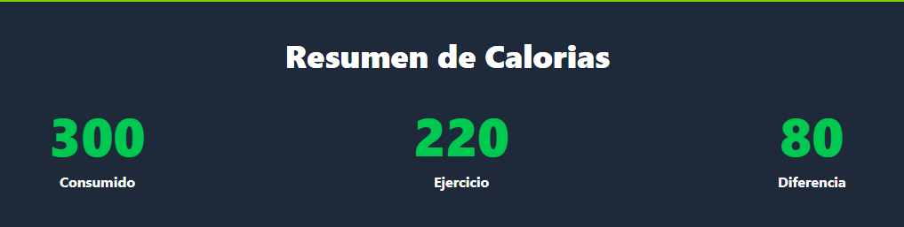
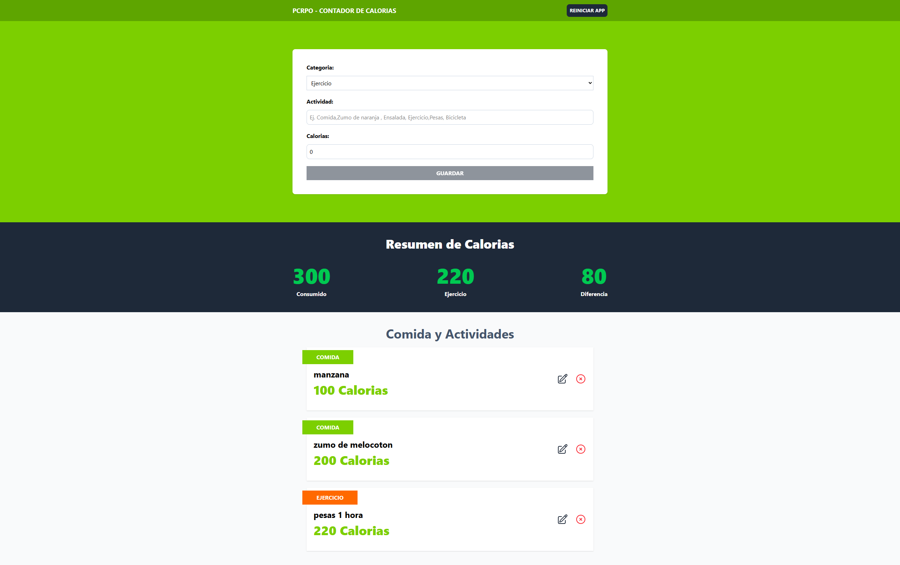

# 🍎 PCPro Calculadora de Calorías

## 📌 Descripción del Proyecto

**PCPro Calculadora de Calorías** es una aplicación web moderna y profesional desarrollada con **React 19**, **TypeScript** y **TailwindCSS** que permite a los usuarios llevar un control preciso y eficiente de su balance calórico diario. 

Esta herramienta está diseñada para **profesionales de la salud**, **entusiastas del fitness**, **nutricionistas** y cualquier persona que desee mantener un estilo de vida saludable mediante el seguimiento inteligente de calorías consumidas y quemadas.

### 🎯 ¿Para quién está pensado?
- **Profesionales de la salud** que necesitan herramientas simples para sus pacientes
- **Entrenadores personales** que buscan aplicaciones de seguimiento para sus clientes  
- **Personas fitness-conscientes** que quieren control total de su balance calórico
- **Desarrolladores** que buscan ejemplos de aplicaciones React modernas y bien estructuradas

---

## ✨ Características Destacadas

### 🛠️ **Funcionalidades Principales**
- **📝 Registro Intuitivo**: Formulario simple con solo 3 campos (Categoría, Actividad, Calorías)
- **⚡ Cálculo en Tiempo Real**: Balance calórico instantáneo con contadores dinámicos
- **📊 Seguimiento Visual**: Diferenciación por colores entre comidas (verde) y ejercicios (naranja)
- **✏️ Edición Completa**: Modifica cualquier actividad registrada con un clic
- **🗑️ Gestión Inteligente**: Elimina actividades individuales o reinicia completamente
- **💾 Persistencia Automática**: Datos guardados automáticamente en el navegador
- **📱 Diseño Responsive**: Funciona perfectamente en móviles, tablets y escritorio

### 🔒 **Características Técnicas Avanzadas**
- **🎯 Gestión de Estado Centralizada**: Implementación con useReducer para operaciones complejas
- **🔄 Optimización de Rendimiento**: useMemo para cálculos eficientes y re-renderizado inteligente
- **🆔 IDs Únicos**: Generación UUID para operaciones seguras de CRUD
- **✅ Validación en Tiempo Real**: Controles de entrada que previenen datos inválidos
- **🎨 UI/UX Profesional**: Animaciones suaves y transiciones elegantes

---

## ⚙️ Funcionalidades

### 📋 **Módulos Principales**

#### 1. **Formulario de Registro (`Form.tsx`)**
- Selección de categoría (Comida/Ejercicio)
- Campo de texto para descripción de la actividad
- Input numérico para calorías con validación
- Botón de guardado que se activa solo con datos válidos
- Limpieza automática del formulario tras el envío

#### 2. **Tracker de Calorías (`CalorieTracker.tsx`)**
- **Calorías Consumidas**: Suma automática de todas las comidas registradas
- **Calorías Quemadas**: Total de calorías de ejercicios realizados
- **Balance Calórico**: Diferencia entre consumidas y quemadas
- Visualización con números grandes y colores distintivos

#### 3. **Lista de Actividades (`ActivityList.tsx`)**
- Listado completo de todas las actividades registradas
- Categorización visual con etiquetas de color
- Botones de acción para editar (lápiz) y eliminar (X)
- Mensaje informativo cuando no hay actividades

#### 4. **Sistema de Persistencia**
- Guardado automático en localStorage del navegador
- Carga automática de datos al iniciar la aplicación
- Sincronización en tiempo real con cada cambio
- Función de reinicio que limpia todos los datos

### 🔧 **Gestión de Estado Avanzada**
El proyecto utiliza **useReducer** con TypeScript para manejar:
- `guardar-actividad`: Crear nuevas actividades o actualizar existentes
- `set-activeID`: Seleccionar actividad para edición
- `delete-activity`: Eliminar actividades específicas
- `restart-app`: Reiniciar completamente la aplicación

---

## 🔧 Tecnologías Utilizadas

### 🚀 **Frontend Framework**
- **⚛️ React 19.1.0**: Framework principal con hooks modernos
- **🧩 TypeScript 5.8.3**: Tipado estático para mayor robustez y mejor DX
- **⚡ Vite 7.0.4**: Build tool moderno para desarrollo rápido y optimización

### 🎨 **Estilos y UI**
- **🎨 TailwindCSS 4.1.11**: Framework CSS utility-first para diseño responsive
- **🎯 Heroicons 2.2.0**: Librería de iconos SVG optimizados y modernos
- **📱 Responsive Design**: Mobile-first con breakpoints adaptativos

### 🛠️ **Herramientas de Desarrollo**
- **🔍 ESLint 9.30.1**: Linting y formateo de código para calidad
- **🆔 UUID 11.1.0**: Generación de identificadores únicos seguros
- **📦 SWC**: Compilador ultra-rápido para React

### 💾 **Almacenamiento**
- **🗄️ LocalStorage**: Persistencia de datos local sin backend
- **🔄 Sincronización Automática**: useEffect para guardado en tiempo real

---

## 📁 Estructura del Proyecto

```
pcpro-calculadora-calorias/
├── 📂 src/
│   ├── 📂 components/
│   │   ├── 📄 Form.tsx              # Formulario de registro de actividades
│   │   ├── 📄 CalorieTracker.tsx    # Contador principal de calorías
│   │   ├── 📄 CalorieDisplay.tsx    # Componente de visualización reutilizable
│   │   └── 📄 ActvityList.tsx       # Lista y gestión de actividades
│   ├── 📂 data/
│   │   └── 📄 categorias.ts         # Definición estática de categorías
│   ├── 📂 reducers/
│   │   └── 📄 activity-reducer.ts   # Lógica centralizada de estado
│   ├── 📂 types/
│   │   └── 📄 index.ts              # Definiciones de tipos TypeScript
│   ├── 📄 App.tsx                   # Componente principal de la aplicación
│   ├── 📄 main.tsx                  # Punto de entrada de React
│   └── 📄 index.css                 # Estilos globales y TailwindCSS
├── 📂 docs/                         # Documentación técnica completa
├── 📂 public/                       # Archivos estáticos y assets
├── 📄 index.html                    # Landing page comercial
├── 📄 package.json                  # Configuración y dependencias
├── 📄 vite.config.ts               # Configuración de Vite
├── 📄 tsconfig.json                # Configuración de TypeScript
└── 📄 README.md                    # Este archivo
```

---

## 🚀 Instrucciones de Uso

### 📦 **Instalación de Dependencias**

```bash
# Clonar el repositorio
git clone https://github.com/franHR11/pcpro-calculadora-calorias.git

# Navegar al directorio del proyecto
cd pcpro-calculadora-calorias

# Instalar dependencias con npm
npm install

# O con yarn
yarn install
```

### ⚙️ **Configuración del Entorno**

No se requieren variables de entorno especiales. La aplicación funciona completamente en el frontend.

```bash
# Archivo .env (opcional para configuraciones futuras)
# VITE_APP_NAME="PCPro Calculadora de Calorías"
# VITE_VERSION="1.0.0"
```

### 🏃‍♂️ **Ejecutar en Desarrollo**

```bash
# Iniciar servidor de desarrollo
npm run dev

# La aplicación estará disponible en:
# http://localhost:5173
```

### 🏗️ **Build para Producción**

```bash
# Generar build optimizado
npm run build

# Los archivos se generarán en la carpeta 'dist/'
```

### 🔍 **Linting y Calidad de Código**

```bash
# Ejecutar ESLint
npm run lint

# Vista previa del build
npm run preview
```

---

## 🧪 Ejemplos de Uso

### 📝 **Registrar una Comida**
1. Selecciona **"Comida"** en el campo Categoría
2. Escribe la descripción: `"Desayuno - Avena con frutas"`
3. Ingresa las calorías: `350`
4. Haz clic en **"Guardar"**

### 🏃‍♂️ **Registrar Ejercicio**
1. Selecciona **"Ejercicio"** en el campo Categoría  
2. Describe la actividad: `"Correr 45 minutos"`
3. Ingresa las calorías quemadas: `450`
4. Haz clic en **"Guardar"**

### 📊 **Monitorear Balance Calórico**
- **Calorías Consumidas**: 1,850 (suma de todas las comidas)
- **Calorías de Ejercicio**: 600 (suma de todos los ejercicios)
- **Diferencia**: +1,250 (superávit calórico)

### ✏️ **Editar una Actividad**
1. Localiza la actividad en la lista
2. Haz clic en el **ícono de lápiz** ✏️
3. Modifica los datos en el formulario
4. Guarda los cambios

### 🗑️ **Eliminar Actividad**
1. Encuentra la actividad a eliminar
2. Haz clic en el **ícono X** ❌
3. La actividad se eliminará inmediatamente

---

## 🖼️ Imágenes del Proyecto

### 📱 **Capturas de Pantalla**

| Funcionalidad | Descripción |
|---------------|-------------|
|  | **Formulario Intuitivo**: Registro simple con validación en tiempo real |
|  | **Seguimiento Dinámico**: Contadores de calorías actualizados automáticamente |
|  | **Gestión Completa**: Lista organizada con opciones de edición y eliminación |
|  | **Diseño Responsive**: Interfaz adaptativa para todos los dispositivos |
|  | **Vista General**: Aplicación completa funcionando en tiempo real |

---

## 🆘 Obtener Ayuda

### 📞 **Soporte y Contacto**

- **📧 Email**: desarrollo@pcprogramacion.es
- **🌐 Sitio Web**: [https://www.pcprogramacion.es](https://www.pcprogramacion.es)
- **💼 LinkedIn**: [Francisco José Herreros](https://linkedin.com/in/francisco-jose-herreros)
- **📱 Teléfono**: +34 628 639 355
- **📍 Ubicación**: Valencia, España

### 🔗 **Enlaces Útiles**

- **🚀 Demo en Vivo**: [https://effortless-kataifi-a3474d.netlify.app/](https://effortless-kataifi-a3474d.netlify.app/)
- **👨‍💻 Más Proyectos**: [https://franhr.pcprogramacion.es/](https://franhr.pcprogramacion.es/)
- **📚 Documentación Técnica**: Ver carpeta `/docs`

---

## 🛡️ Licencia

### **Español**

**Copyright (c) 2025 Francisco José Herreros (franHR) / PCProgramación**

Todos los derechos reservados.

Este software es propiedad de Francisco José Herreros (franHR), desarrollador de PCProgramación (https://www.pcprogramacion.es). No está permitido copiar, modificar, distribuir o utilizar este código, ni total ni parcialmente, sin una autorización expresa y por escrito del autor.

El acceso a este repositorio tiene únicamente fines de revisión, auditoría o demostración, y no implica la cesión de ningún derecho de uso o explotación.

Para solicitar una licencia o permiso de uso, contacta con: desarrollo@pcprogramacion.es

### **English**

**Copyright (c) 2025 Francisco José Herreros (franHR) / PCProgramación**

All rights reserved.

This software is the property of Francisco José Herreros (franHR), developer of PCProgramación (https://www.pcprogramacion.es). It is not allowed to copy, modify, distribute or use this code, either totally or partially, without express and written authorization from the author.

Access to this repository has only review, audit or demonstration purposes, and does not imply the transfer of any right of use or exploitation.

To request a license or permission to use, contact: desarrollo@pcprogramacion.es

---

## 📅 Información del Proyecto

- **📅 Año**: 2025
- **👨‍💻 Autor**: Francisco José Herreros (franHR)
- **🏢 Empresa**: PCProgramación
- **🔖 Versión**: 1.0.0
- **📊 Estado**: Producción
- **🔄 Última Actualización**: Febrero 2025

---

## 🔝 Hashtags Recomendados para LinkedIn

```
#React #TypeScript #TailwindCSS #WebDevelopment #Frontend #JavaScript 
#HealthTech #FitnessApp #CalorieTracker #ResponsiveDesign #ModernWeb 
#ReactHooks #Vite #LocalStorage #UXDesign #WebApp #PortfolioProject 
#PCProgramacion #Valencia #España #FullStackDeveloper #OpenSource
```

---

**⭐ Si este proyecto te ha sido útil, no olvides darle una estrella en GitHub y compartirlo en tus redes sociales**

*Desarrollado con ❤️ por Francisco José Herreros para ayudarte a mantener un estilo de vida saludable*